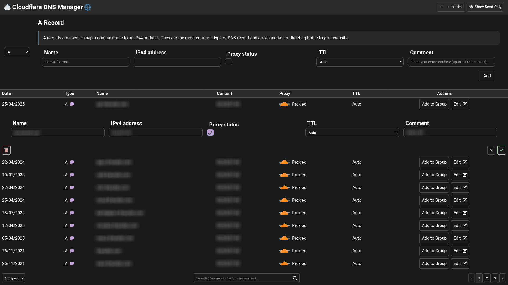

# ☁️ Cloudflare DNS Manager 🌐

Cloudflare DNS Manager is a sleek, web-based tool designed to make managing your Cloudflare DNS records a breeze. Whether you're a developer, sysadmin, or just someone managing a website, this app provides an intuitive interface for creating, updating, deleting, and organizing DNS records.

---

## ✨ Features

- 🛠️ **DNS Record Management**: Add, edit, and delete DNS records (A, AAAA, CNAME, MX, TXT, etc.).
- 📂 **Grouping**: Organize DNS records into custom groups for better management.
- 🔍 **Search and Filter**: Quickly find records by name, content, or comment, and filter by record type.
- 📄 **Pagination**: View records in paginated chunks with customizable entries per page.
- 👁️ **Read-Only Toggle**: Show or hide read-only DNS records with a single click.
- ✅ **Validation**: Ensure your Cloudflare API credentials are valid before performing operations.
- 🔔 **Dynamic Toast Notifications**: Get real-time feedback on actions like saving, deleting, or validation errors.
- 🎨 **Customizable Themes**: Modify CSS variables to match your brand or personal style.

---

## 🎯 Use Cases

- **Web Developers**: Quickly manage DNS records for multiple projects.
- **System Administrators**: Organize and group DNS records for better visibility.
- **Small Business Owners**: Simplify DNS management without needing technical expertise.
- **Power Users**: Use advanced features like filtering, grouping, and record validation.

---

## 🚀 Installation

1. **Clone the repository**:
   ```bash
   git clone https://github.com/thenolle/cloudflare-dns-manager.git
   cd cloudflare-dns-manager
   ```

2. **Install dependencies**:
   - Ensure you have a web server (e.g., Apache or Nginx) and PHP installed.
   - Place the project in your web server's document root (e.g., `/var/www/html`).

3. **Configure the proxy URL**:
   - Update the `PROXY_URL` in `/js/cloudflare/entrypoint.js` to point to your Cloudflare proxy endpoint.

4. **Start the web server**:
   - Access the application in your browser (e.g., `http://localhost/cloudflare-manager`).

---

## 🧑‍💻 Usage

### 1️⃣ **Set Credentials**
- Open the application in your browser.
- Enter your Cloudflare API token and Zone ID in the credentials modal.
- Validate and save the credentials.

### 2️⃣ **Manage DNS Records**
- Use the form at the top to create new DNS records.
- View, edit, or delete records in the table below.

### 3️⃣ **Organize Records**
- Group records for better organization.
- Use the group modal to create, edit, or delete groups.

### 4️⃣ **Search and Filter**
- Use the search bar to find records by name, content, or comment.
- Filter records by type using the dropdown.

### 5️⃣ **Pagination**
- Adjust the number of records per page using the "entries" dropdown.

---

## 📂 File Structure

- **`/assets`**: Third-party libraries and static assets (icons, styles, etc.).
- **`/css`**: Stylesheets for the application.
- **`/js`**: JavaScript modules for managing DNS records, rendering UI components, and handling API interactions.
  - **`/cloudflare`**: Modules for interacting with the Cloudflare API.
  - **`/models`**: Data models for DNS records, groups, and credentials.
  - **`/renderers`**: UI rendering logic for forms, tables, and modals.
  - **`/utils`**: Utility functions for DOM manipulation, normalization, and encryption.
- **`/index.html`**: Main entry point for the application.

---

## 🛠️ Development

### Prerequisites
- A modern browser for testing

### Running Locally
1. Start a local web server:
   ```bash
   php -S localhost:8000
   ```
2. Open `http://localhost:8000` in your browser.

### Code Structure
- **Modular Design**: The application is divided into reusable modules for better maintainability.
- **Dynamic Rendering**: UI components are dynamically rendered using JavaScript.
- **Local Storage**: Credentials and group data are stored in the browser's local storage.

### Key Modules
- **`CredentialManager`**: Handles API token and Zone ID storage and validation.
- **`GroupManager`**: Manages record grouping and persistence.
- **`RecordStore`**: Manages the state of DNS records and applies filters.

---

## 🌐 API Integration

The application interacts with the Cloudflare API through a proxy endpoint. Ensure the proxy is correctly configured to handle requests to the Cloudflare API.

### Endpoints Used
- `GET /zones/:zone_id/dns_records` - List DNS records.
- `POST /zones/:zone_id/dns_records` - Create a DNS record.
- `PUT /zones/:zone_id/dns_records/:id` - Update a DNS record.
- `DELETE /zones/:zone_id/dns_records/:id` - Delete a DNS record.

---

## 🎨 Customization

- **Themes**: Modify CSS variables in `/css/base.css` to customize the application's appearance.
- **Record Types**: Add or modify DNS record configurations in `/js/form-config.js`.

---

## 🤝 Contributing

Contributions are welcome! Here's how you can help:

1. Fork the repository.
2. Create a new branch for your feature or bugfix.
3. Submit a pull request with a detailed description of your changes.

---

## 📜 License

This project is licensed under the [`NFE-OSL v1.0`](https://cafe.thenolle.com/nfe-osl/) License. See the [`LICENSE`](./LICENSE) file for details.

---

## 🙌 Acknowledgments

- [Font Awesome](https://fontawesome.com/) for icons.
- Cloudflare for providing the API used in this project.

---

## 📸 Screenshots

### Dashboard


### Group Modal


### Form


---

Happy managing your DNS records! 🚀
